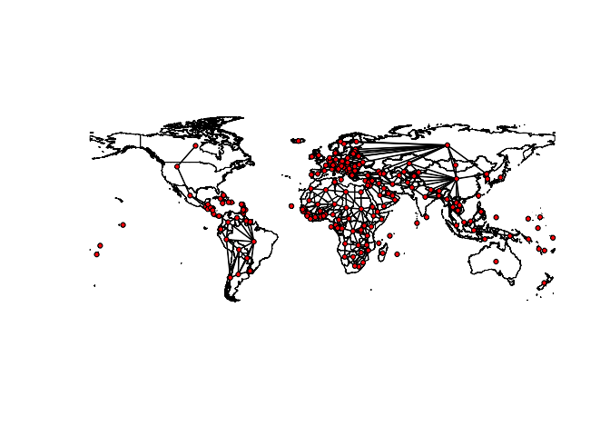

<!-- README.md is generated from README.Rmd. Please edit that file -->

# wstates

<!-- badges: start -->

[](https://travis-ci.com/andybega/wstates)
[](https://codecov.io/gh/andybega/wstates?branch=master)
<!-- badges: end -->

The goal of wcshapes is to make spatial lagging with country-year but
also other panel data easier.

**Note: this is still in very early stages. Use with caution.**

## Installation

To install the latest version from GitHub:

``` r
library("remotes")
install_github("andybega/wstates")
```

The package is not on CRAN.

<!--

You can install the released version of wstates from [CRAN](https://CRAN.R-project.org) with:

``` r
install.packages("wstates")
```

-->

## Example

``` r
library("wstates")
library("sf")
#> Linking to GEOS 3.7.2, GDAL 2.4.2, PROJ 5.2.0
library("ggplot2")

data("est_adm1")

est_adm1$x <- as.integer(est_adm1$NAME_1 == "Harju")
w0 <- w_dist_power(st_geometry(est_adm1), alpha = .5)
w1 <- w_dist_power(st_geometry(est_adm1), alpha = 2)
w2 <- w_contiguity(st_geometry(est_adm1))
est_adm1$x_sl0 <- as.numeric(w0 %*% est_adm1$x)
est_adm1$x_sl1 <- as.numeric(w1 %*% est_adm1$x)
est_adm1$x_sl2 <- as.numeric(w2 %*% est_adm1$x)

plot(est_adm1[, c("x", "x_sl0", "x_sl1", "x_sl2")])
```


``` r
library("states")

# Get W matrix for certain date
w <- wstates("2010-01-01")
w
#> Spatial weights matrix [194 x 194]
#> Type: Contiguity (rook)
plot(w)
```



``` r
states <- state_panel(as.Date("2011-12-31"), as.Date("2012-12-31"), partial = "exact")
states <- subset(states, !states$gwcode %in% c(396, 397))
states$x <- as.integer(
  (states$gwcode %in% c(2, 260, 490) & states$date=="2011-12-31") |
  (states$gwcode %in% c(2) & states$date=="2012-12-31"))

# spatial lag x
states$slag_x <- spatlag(states$x, states$gwcode, states$date)
head(states$slag_x)
#> [1] 0 0 1 1 0 0

# or, equivalently
states <- states %>%
  dplyr::mutate(slag_x = spatlag(x, gwcode, date))
dplyr::filter(states, slag_x > 0)
#>    gwcode       date x    slag_x
#> 1      20 2011-12-31 0 1.0000000
#> 2      20 2012-12-31 0 1.0000000
#> 3      70 2011-12-31 0 0.3333333
#> 4      70 2012-12-31 0 0.3333333
#> 5     210 2011-12-31 0 0.5000000
#> 6     211 2011-12-31 0 0.2500000
#> 7     212 2011-12-31 0 0.3333333
#> 8     220 2011-12-31 0 0.1250000
#> 9     225 2011-12-31 0 0.2000000
#> 10    290 2011-12-31 0 0.1428571
#> 11    305 2011-12-31 0 0.1250000
#> 12    316 2011-12-31 0 0.2500000
#> 13    390 2011-12-31 0 1.0000000
#> 14    482 2011-12-31 0 0.1666667
#> 15    484 2011-12-31 0 0.2000000
#> 16    500 2011-12-31 0 0.2000000
#> 17    510 2011-12-31 0 0.1250000
#> 18    516 2011-12-31 0 0.3333333
#> 19    517 2011-12-31 0 0.2500000
#> 20    540 2011-12-31 0 0.2500000
#> 21    551 2011-12-31 0 0.1428571
#> 22    626 2011-12-31 0 0.1666667
```
