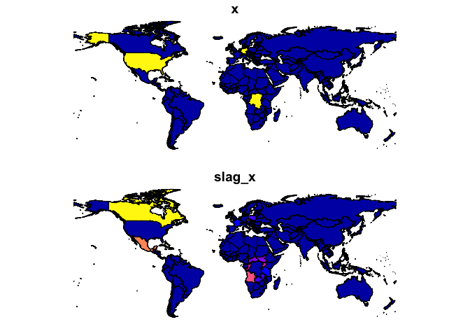
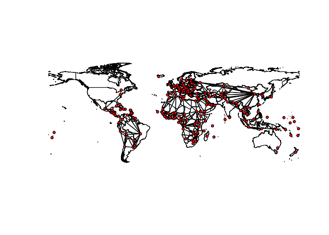
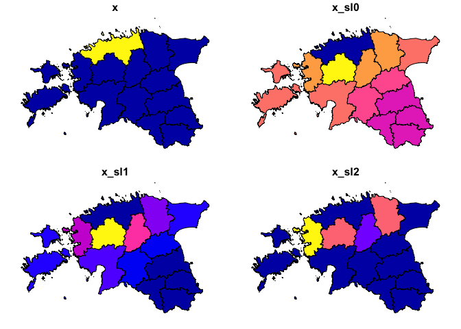

<!-- README.md is generated from README.Rmd. Please edit that file -->

# wstates

<!-- badges: start -->

[](https://travis-ci.com/andybega/wstates)
[](https://codecov.io/gh/andybega/wstates?branch=master)
<!-- badges: end -->

The goal of wcshapes is to make spatial lagging with country-year but
also other panel data easier.

**Note: this is still in very early stages. Use with caution.**

## Installation

To install the latest version from GitHub:

``` r
library("remotes")
install_github("andybega/wstates")
```

The package is not on CRAN.

<!--

You can install the released version of wstates from [CRAN](https://CRAN.R-project.org) with:

``` r
install.packages("wstates")
```

-->

## Example

The core function `spatlag()` spatially lags variables in a country-year
dataset. It is self-aware of the Gleditsch and Ward statelist and will
construct spatial weights matrices using the time-appropriate set of
independent states using shapefiles from the
[**cshapes**](https://cran.r-project.org/package=cshapes) package.

First, let’s construct a panel dataset with a variable, `x`, that is 1
for a limited number of country-years. **wstates** is setup to work in
conjunction with the [**states**](https://github.com/andybega/states)
package, which generates country-year data matching the G\&W statelist
using `state_panel()`:

``` r
library("states")
library("wstates")
library("sf")
#> Linking to GEOS 3.7.2, GDAL 2.4.2, PROJ 5.2.0
library("ggplot2")

states <- state_panel(as.Date("2011-12-31"), as.Date("2012-12-31"), partial = "exact")
states <- subset(states, !states$gwcode %in% c(396, 397))
states$x <- as.integer(
  (states$gwcode %in% c(2, 260, 490) & states$date=="2011-12-31") |
  (states$gwcode %in% c(2) & states$date=="2012-12-31"))
```

And here is how to spatially lag `x`:

``` r
# spatial lag x
states$slag_x <- spatlag(states$x, states$gwcode, states$date)

# or, equivalently
states <- states %>%
  dplyr::mutate(slag_x = spatlag(x, gwcode, date))
```

A visual check that the lagging was correct:

``` r
# Add geometry to country-year data
states2011 <- states[states$date=="2011-12-31", ]
geom2011   <- read_cshapes(as.Date("2011-12-31"))
states2011 <- dplyr::left_join(states2011, geom2011, by = c("gwcode" = "GWCODE"))
states2011 <- states2011 %>% st_set_geometry("geometry")

plot(states2011[, c("x", "slag_x")])
```



### Country-year W matrices

`wstates()` creates W matrices for the independent states at a given
date. This is useful for visualizing the relationships.

``` r
# Get W matrix for certain date
w <- wstates("2010-01-01")
w
#> Spatial weights matrix [194 x 194]
#> Type: Contiguity (rook)
plot(w)
```



### Types of weights matrices

I’ve been using (rook) contiguity for now during development, but the
plan is to add more. Here’s one with power-weighted inverse distance:

``` r
data("est_adm1")

est_adm1$x <- as.integer(est_adm1$NAME_1 == "Harju")
w0 <- w_dist_power(st_geometry(est_adm1), alpha = .5)
w1 <- w_dist_power(st_geometry(est_adm1), alpha = 2)
w2 <- w_contiguity(st_geometry(est_adm1))
est_adm1$x_sl0 <- as.numeric(w0 %*% est_adm1$x)
est_adm1$x_sl1 <- as.numeric(w1 %*% est_adm1$x)
est_adm1$x_sl2 <- as.numeric(w2 %*% est_adm1$x)

plot(est_adm1[, c("x", "x_sl0", "x_sl1", "x_sl2")])
```


