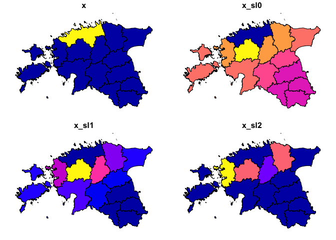

<!-- README.md is generated from README.Rmd. Please edit that file -->

# wstates

<!-- badges: start -->

[](https://travis-ci.com/andybega/wstates)
<!-- badges: end -->

The goal of wcshapes is to make spatial lagging with country-year but
also other panel data easier.

## Installation

``` r
library("remotes")
install_github("andybega/wstates")
```

NOPE NOT YET:

You can install the released version of wstates from
[CRAN](https://CRAN.R-project.org) with:

``` r
install.packages("wstates")
```

## Example

``` r
library("wstates")
library("sf")
#> Linking to GEOS 3.6.1, GDAL 2.1.3, PROJ 4.9.3
library("ggplot2")

data("est_adm1")

est_adm1$x <- as.integer(est_adm1$NAME_1 == "Harju")
w0 <- w_dist_power(st_geometry(est_adm1), alpha = .5)
w1 <- w_dist_power(st_geometry(est_adm1), alpha = 1)
w2 <- w_dist_power(st_geometry(est_adm1), alpha = 2)
est_adm1$x_sl0 <- as.numeric(w0 %*% est_adm1$x)
est_adm1$x_sl1 <- as.numeric(w1 %*% est_adm1$x)
est_adm1$x_sl2 <- as.numeric(w2 %*% est_adm1$x)

plot(est_adm1[, c("x", "x_sl0", "x_sl1", "x_sl2")])
```


